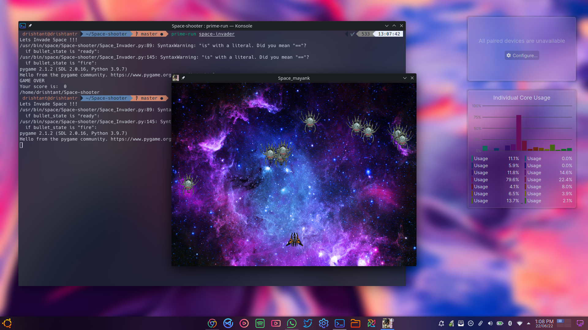

Make sure `pip` is already installed, if not then run this in terminal

`sudo apt install python3-pip`

Go into cloned repo using cd command

Make install.sh script executable and then Run it with sudo

`sudo chmod +x install.sh`
`sudo ./install.sh`

Finally You can run game by using `space-invader` in terminal!

Happy Gaming!!!

Here is a game screen shot

